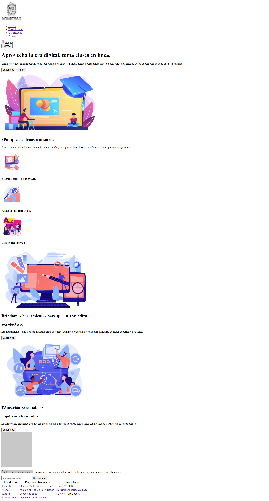
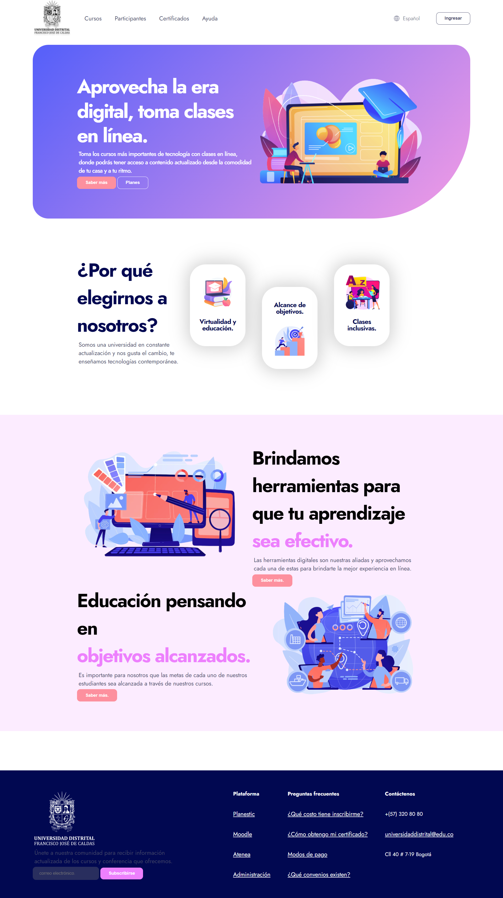
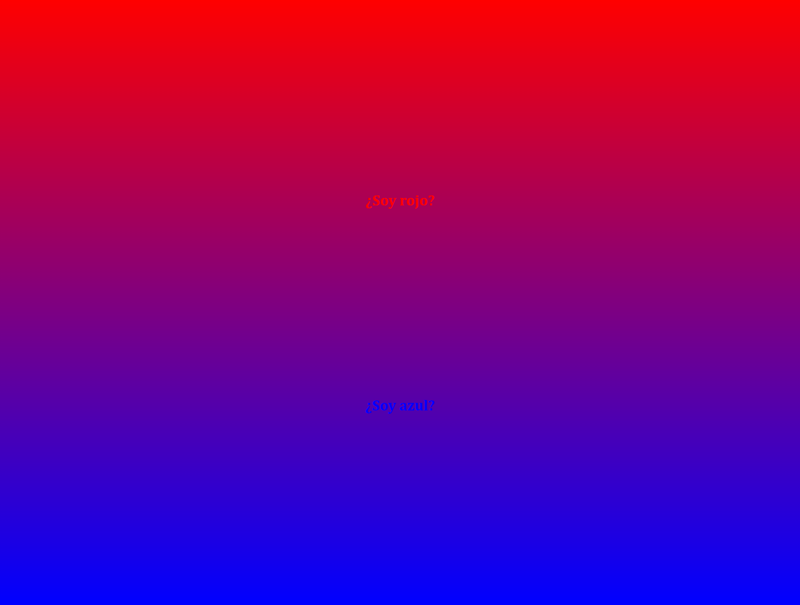
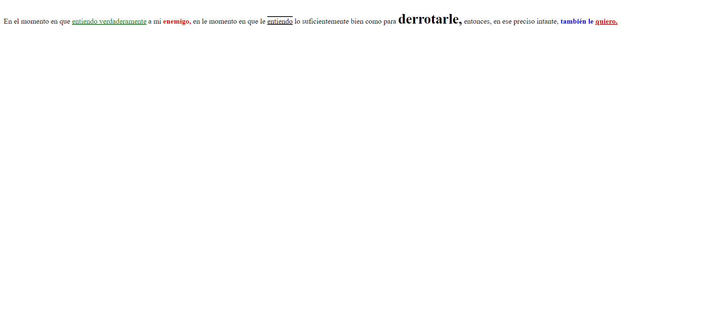
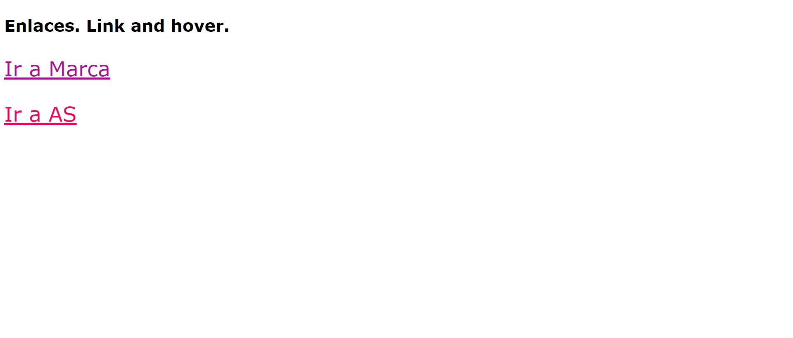
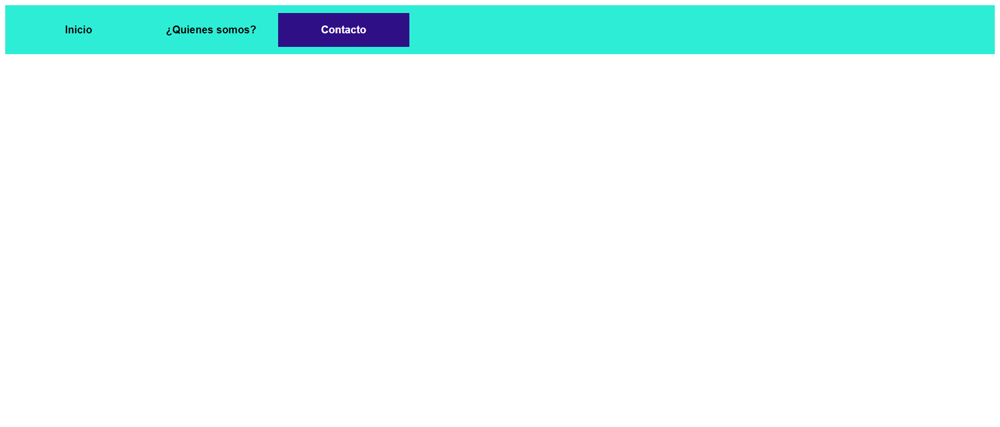
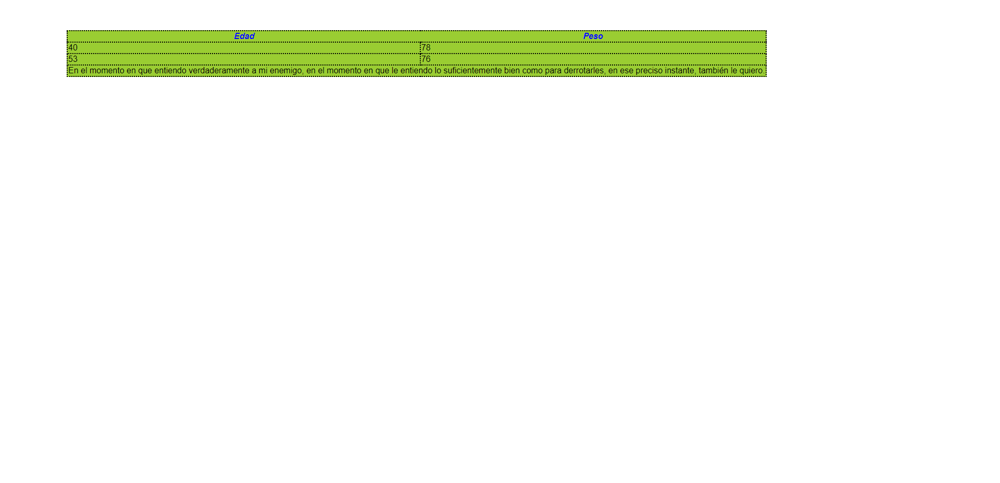

<!-- ESTE ARCHIVO ME SIRVE PARA DECIR SOBRE QUÉ VA MI PROYECTO EN GITHUB -->
<h1> Taller 9: Heidy Sandoval </h1>
<h2> Información </h2>

 Curso: Full Stack básico - grupo 1 

 Profesor: Cristian Patiño 

<h2> Punto 1: Link de Figma </h2>
<a href="https://www.figma.com/file/w5OEZqnhbLwjee1Hyt1GMv/Heidy-Sandoval---Taller-9%3A-punto-1?type=design&node-id=0%3A1&mode=design&t=9nBzkCbPhksLkGC4-1"> Link de Figma 
</a>

<h2> Punto 2: HTML </h2>

<h2> Punto 3: CSS </h2>

<h2> Punto 4 </h2>

<h2> Punto 5 </h2>

<h2> Punto 6 </h2>

<h2> Punto 7-8 </h2>

<h2> Punto 9 </h2>
